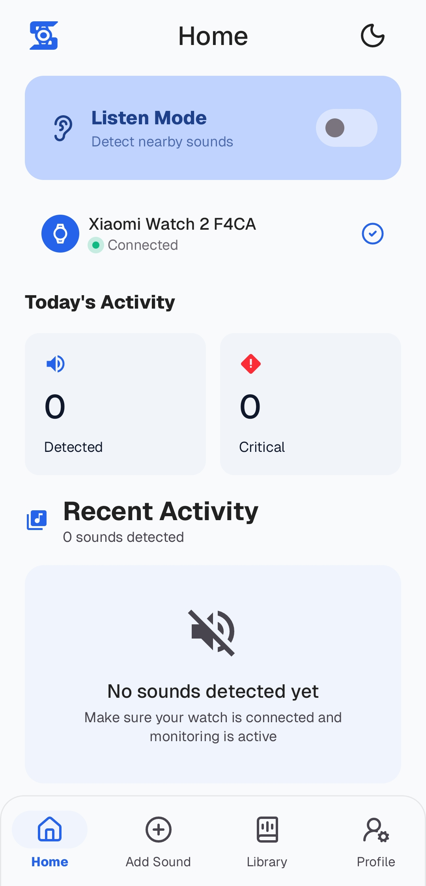

<h3 align="center">Sonavi</h3>

---

<p align="center">
  A Sound Detection System for the Deaf and Hard of Hearing using On-Device Machine Learning
</p>
<p align="center">
  <a href="https://github.com/xyugen/sonavi/releases/latest">
    
  </a>
  <a href="LICENSE">
    
  </a>
</p>

## 📖 Summary

This repository serves as the compiled package of our capstone project for **Bulacan State University - Sarmiento Campus** entitled: **_"AI-Driven Mobile Platform with IoT-Enabled Haptic Feedback for Real-Time Sound Recognition and Emergency Alerts for Deaf Individuals"_**

## 📑 Contents

- [:book: About](#book-about)
- [:star: Features](#star-features)
- [:camera: Screenshots](#camera-screenshots)
- [:gear: How It Works](#gear-how-it-works)
- [:toolbox: Tech Stack](#toolbox-tech-stack)
- [:inbox_tray: Installation](#inbox_tray-installation)
- [:clipboard: Requirements](#clipboard-requirements)
- [:busts_in_silhouette: Team](#busts_in_silhouette-team)
- [:trophy: Acknowledgements](#trophy-acknowledgements)

## :book: About

**Sonavi** is a sound detection system that alerts Deaf and Hard of Hearing users to environmental sounds through customizable smartwatch vibrations. We harness the power of on-device machine learning to detect and classify sounds captured by a Wear OS smartwatch, process them on an Android mobile device, and deliver haptic feedback—all without requiring an internet connection.

We implemented the YAMNet audio classification model using LiteRT (formerly TensorFlow Lite) for real-time sound detection. The system allows users to detect pre-trained sounds as well as create custom sound profiles by recording or uploading their own audio samples, making it highly personalized and adaptable to individual needs.

## :star: Features

- **🎧 Real-time Sound Detection**: Captures audio from your Wear OS smartwatch and processes it instantly on your Android phone
- **🤖 On-Device Machine Learning**: Uses YAMNet model via LiteRT (TensorFlow Lite) for accurate sound classification
- **📳 Customizable Vibration Patterns**: Set unique vibration alerts for different sound types
- **🎵 Custom Sound Training**: Create personalized sound profiles by recording or uploading 3+ samples of specific sounds you want to detect
- **🔒 Privacy-First**: All processing happens on-device; no data leaves your phone
- **⚡ Low Latency**: Optimized communication between watch and phone for quick notifications

## :camera: Screenshots

| Screenshot 1 | Screenshot 2 |
|------|------|
|  |  |

## :gear: How It Works

1. **Capture**: The Wear OS smartwatch continuously listens for ambient sounds
2. **Transmit**: Audio data is sent to the paired Android mobile device
3. **Process**: The mobile app uses the YAMNet ML model to classify the sound
4. **Notify**: If a registered sound is detected, a vibration pattern is sent back to the smartwatch

## :toolbox: Tech Stack

- **Languages**: Kotlin, Java
- **Machine Learning**: [LiteRT](https://ai.google.dev/edge/litert) (formerly TensorFlow Lite)
- **ML Model**: [YAMNet](https://tfhub.dev/google/lite-model/yamnet/classification/tflite/1) for audio event classification
- **Platform**: Android 8.1+ (API 27), Wear OS 3+
- **Architecture**: MVVM pattern with offline-first approach

## :inbox_tray: Installation

### Option 1: Download APK
1. Download the latest release from the [Releases](../../releases) page
2. Install the mobile APK on your Android phone
3. Install the Wear OS APK on your smartwatch
4. Pair your devices if not already paired

### Option 2: Build from Source
```bash
# Clone the repository
git clone https://github.com/xyugen/sonavi.git
cd sonavi

# Build mobile app
./gradlew :mobile:assembleDebug

# Build wear app
./gradlew :wear:assembleDebug

# Install to connected devices
./gradlew installDebug
```

## :clipboard: Requirements

- **Mobile Device**: Android 8.1 (Oreo, API 27) or higher
- **Wearable Device**: Wear OS 3 or higher

## :busts_in_silhouette: Team

**Capstone Project Team**

| Role | Name |
|------|------|
| Project Leader & Lead Developer | [Renz Arias](https://github.com/xyugen) |
| Researcher | Ara Garong |
| Researcher | [Angel Estonina](https://github.com/yoshirrrr) |
| Quality Assurance | [Jeric Gonzales](https://github.com/SumaiL-Hassan) |
| UI/UX Designer | [Jomel Mislos](https://github.com/jomlx) |

## :trophy: Acknowledgements

| Name | Contributions |
|------|---------------|
| [Dr. Mary Grace G. Hermogenes](https://scholar.google.com/citations?user=CT7cwdoAAAAJ&hl=en) | Our ever-supportive Capstone Professor |
| [Dr. Marlon D.P. Hernandez](https://scholar.google.com/citations?user=Mh_6IykAAAAJ&hl=en) | Our ever-supportive Capstone Adviser |


This README was inspired by [ScolioVis](https://github.com/Blankeos/scoliovis).

---

<div align="center">
Made with ❤️ for the Deaf and Hard of Hearing community
</div>